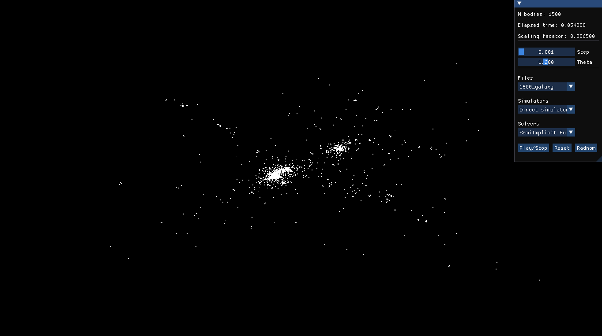

# N-body simulation

This project was done for the course Numerical Algorithms and Numerical Software.

Following numerical methods have been implemented for calculating body position and velocity:

- Forward Euler method
- Semi-implicit Euler method
- Verlet integration

As for the body acceleration, two methods have been used:

- Direct method
- Barnes-Hut method



### Libraries

Before bulding this project, following libraries need to be installed on the system:

- [GLM v1.0.0](https://github.com/g-truc/glm)
- [GLFW v3.3.9](https://www.glfw.org/)
- [OpenGL v3.3](https://www.opengl.org/)
- [ImGui v1.90.1](https://github.com/ocornut/imgui)

ImGui should be downloaded from main GitHub repository and placed inside of `imgui/` directory inside of root project directory.

### How to build

This project uses `cmake` for building process.

First created `build/` directory inside of root project directory.

This project can be build in DEBUG and RELEASE mode. When building in RELEASE mode all necessary g++ flags
are enabled in order to achive maximal performance.

RELEASE mode:
```
cd build
cmake -DDEBUG=OFF ..
make
```

DEBUG mode:
```
cd build
cmake -DDEBUG=ON ..
make
```

### Examples


